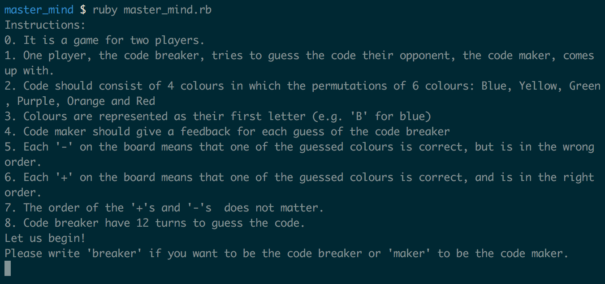
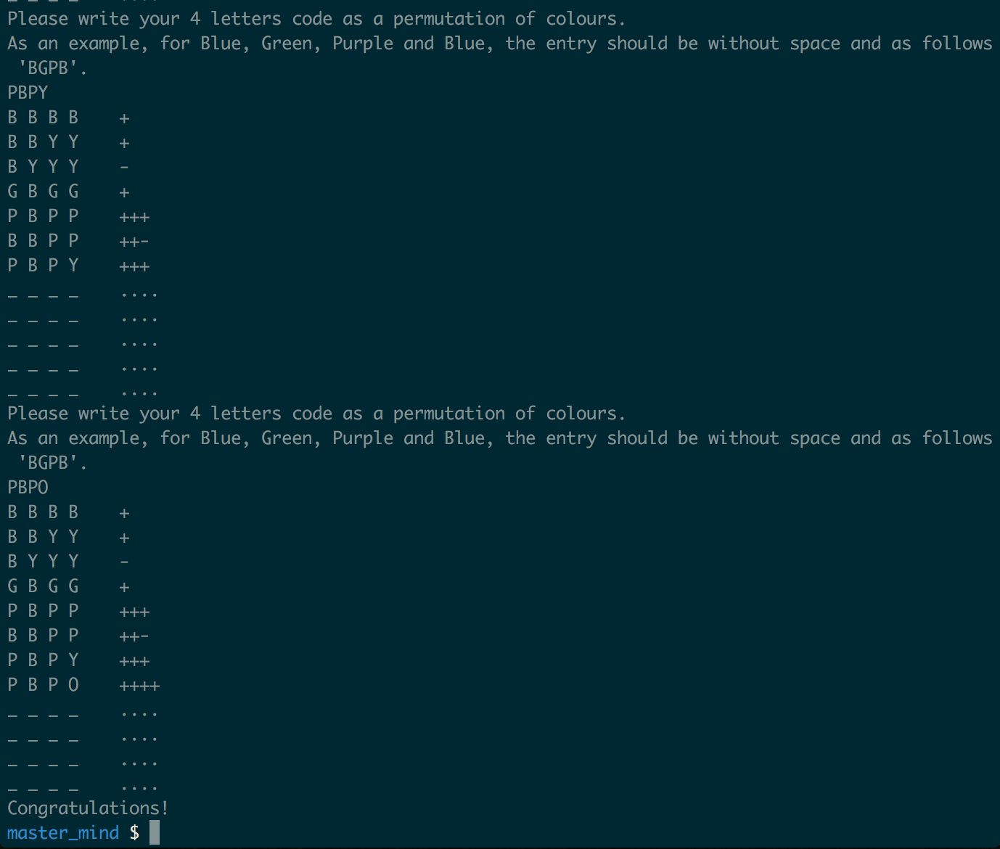
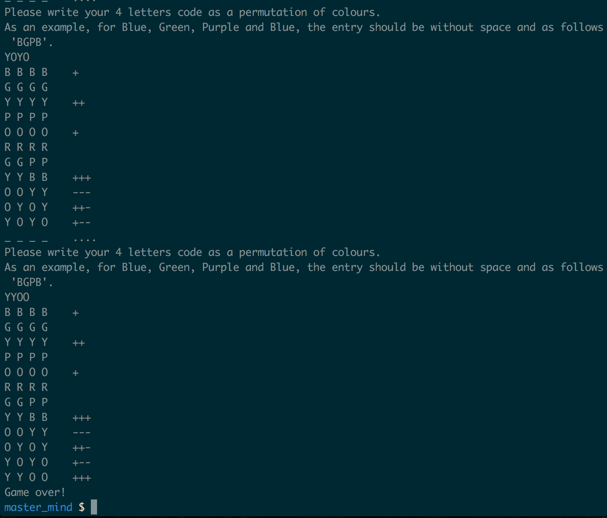
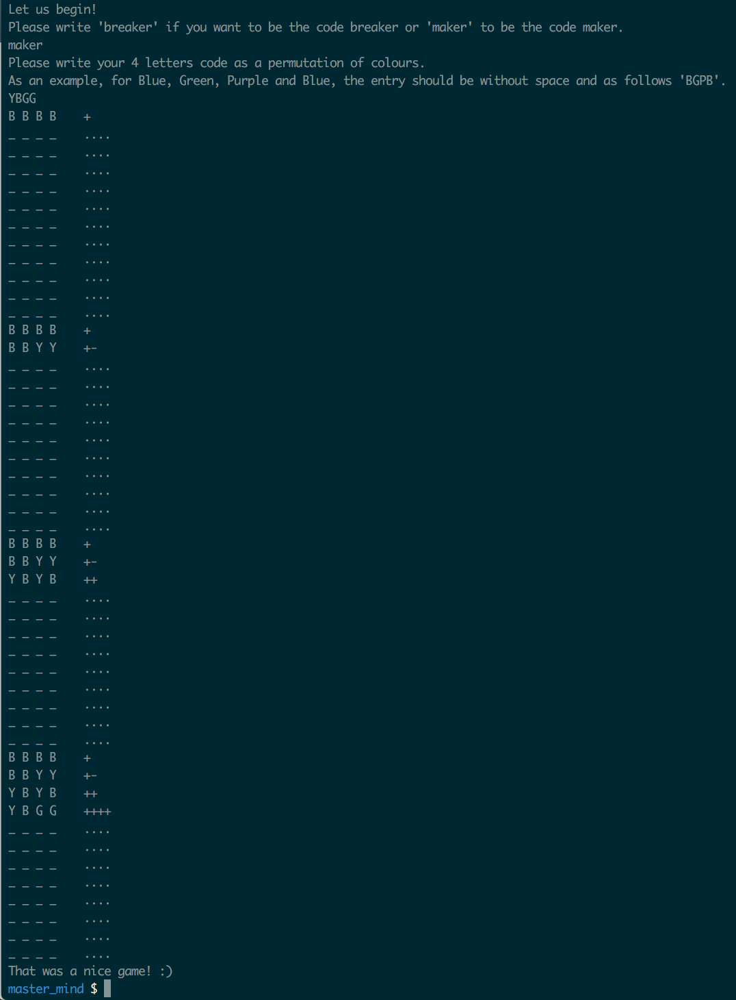

## Prints the rules, then asks if the player wants to be code breaker or code maker

## When the player is the one who guesses

### When the player wins

### When the player loses

## When the code is the one who guesses

It can guess the code in some cases:

